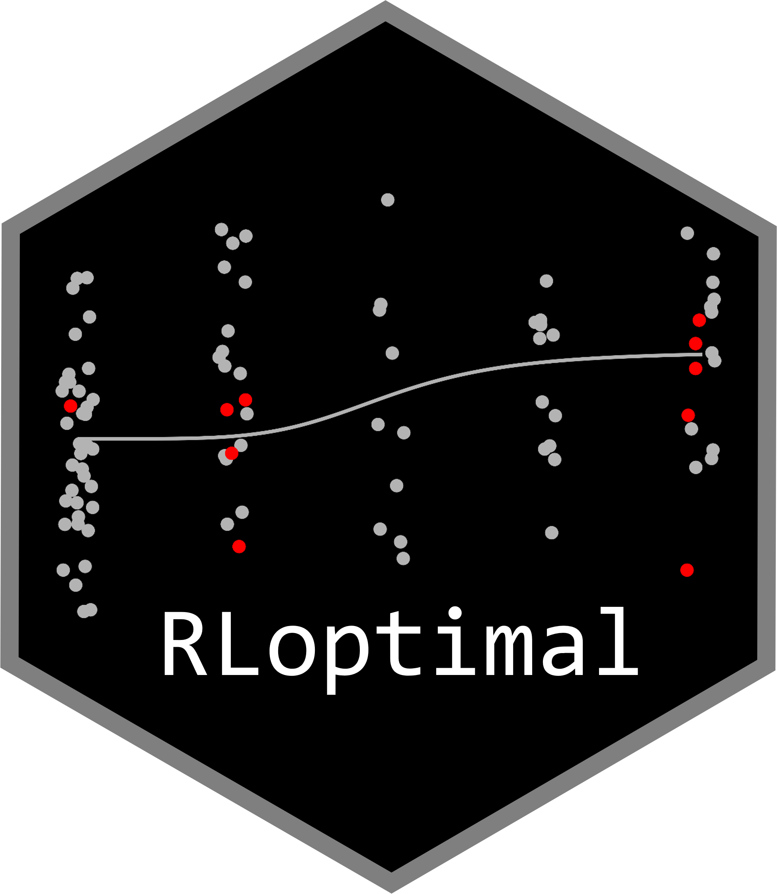

<!-- README.md is generated from README.Rmd. Please edit that file -->

```{r, include = FALSE}
knitr::opts_chunk$set(
  collapse = TRUE,
  comment = "#>",
  fig.path = "man/figures/README-",
  out.width = "100%"
)
```

# RLoptimal 

<!-- badges: start -->
[](https://cran.r-project.org/package=RLoptimal)
[](https://cran.r-project.org/package=RLoptimal)
[](https://github.com/MatsuuraKentaro/RLoptimal/actions/workflows/R-CMD-check.yaml)
<!-- badges: end -->

## Overview

The purpose of this `RLoptimal` package is to easily construct an adaptive allocation rule that directly optimizes a performance metric, such as power, accuracy of the estimated target dose, or mean absolute error over the estimated dose-response curve. Several high-level functions are also provided to make it easy to perform simulation studies.

## Installation

You can install the stable version from CRAN as follows.

```{r eval=FALSE}
install.packages("RLoptimal")
```

You can install the development version from GitHub as follows.

```{r eval=FALSE}
# install.packages("remotes")
remotes::install_github("MatsuuraKentaro/RLoptimal")
```

# Example

We demonstrate computing an optimal adaptive allocation by reinforcement learning for the example in Section 3 of [the original paper](https://doi.org/10.1002/sim.9247).

When you load `RLoptimal` as follows, Python itself and the Python packages to conduct reinforcement learning will be installed.

```{r eval=FALSE}
library(RLoptimal)
```

```{r eval=FALSE, echo=FALSE}
RLoptimal::setup_python()
```

## Build dose-response models for MCPMod

We build the dose-response models to be used in the MCPMod method, which we plan to execute at the end of the clinical trial.

```{r}
doses <- c(0, 2, 4, 6, 8)

models <- DoseFinding::Mods(
  doses = doses, maxEff = 1.65,
  linear = NULL, emax = 0.79, sigEmax = c(4, 5)
)
```

## Learn an allocation rule

We obtain an optimal adaptive allocation rule by executing `learn_allocation_rule()` with the `models`.

```{r eval=FALSE}
allocation_rule <- learn_allocation_rule(
  models,
  N_total = 150, N_ini = rep(10, 5), N_block = 10, Delta = 1.3,
  outcome_type = "continuous", sd_normal = sqrt(4.5), 
  seed = 123, rl_config = rl_config_set(iter = 1000),
  alpha = 0.025
)

allocation_rule
#> <AllocationRule>
#> dir: allocation_rules/20241201_114609
#> created at: 2024-12-01 14:48:40
#> call:
#> learn_allocation_rule(models = models, N_total = 150, N_ini = rep(10, 
#>     5), N_block = 10, Delta = 1.3, outcome_type = "continuous", 
#>     sd_normal = sqrt(4.5), seed = 123, rl_config = rl_config_set(iter = 1000), 
#>     alpha = 0.025)
#> iterations: 1000
#> checkpoints: 500, 600, 700, 800, 900, 1000
```

With the default settings, it takes roughly 10-50 seconds per iter, so it would take about 3-14 hours when `iter = 1000`.

## How to use the allocation rule

To compute allocation ratios using the obtained allocation rule, pass dose and response data to `opt_allocation_probs()`.

```{r eval=FALSE}
some_doses <- c( 0,  0,  0,  0,  2,  2,  4,  4,  4,  6,  6,   8,  8,   8)
some_resps <- c(.2, .1, .0, .3, .2, .4, .1, .6, .8, .5, .8, 1.1, .9, 1.6)

allocation_rule$opt_allocation_probs(some_doses, some_resps)
#>            0            2            4            6            8 
#> 6.023860e-02 5.389110e-06 3.485905e-04 1.684970e-05 9.393906e-01
```

When 10 subjects in the next block are allocated to each dose according to these probabilities, we recommend using `DoseFinding::rndDesign()`.

```{r eval=FALSE}
probs <- allocation_rule$opt_allocation_probs(some_doses, some_resps)
DoseFinding::rndDesign(probs, 10)
#> [1] 1 0 1 0 8
```

## Simulation-based adjustment of the significance level
In general, an adaptive allocation may inflate alpha (see Section 3.3 in the original paper). Therefore, the significance level should be adjusted by simulation using `adjust_significance_level` function.

```{r eval=FALSE}
adjusted_alpha <- adjust_significance_level(
  allocation_rule, models,
  N_total = 150, N_ini = rep(10, 5), N_block = 10,
  outcome_type = "continuous", sd_normal = sqrt(4.5),
  alpha = 0.025, n_sim = 10000, seed = 123
)

adjusted_alpha
#> [1] 0.02021423
```

## How to evaluate the allocation rule
A convenient high-level function (`simulate_one_trial`) is provided to evaluate the obtained allocation rule. The following is an example of code to perform a simulation study similar to Section 3 in the original paper.

```{r eval=FALSE}
eval_models <- DoseFinding::Mods(
  doses = doses, maxEff = 1.65,
  linear = NULL, emax = 0.79, sigEmax = c(4, 5), exponential = 1, quadratic = - 1/12
)
true_response_matrix <- DoseFinding::getResp(eval_models, doses = doses)
true_response_list <- as.list(data.frame(true_response_matrix, check.names = FALSE))

n_sim <- 1000  # the number of simulated clinical trials
sim_list <- list()

for (true_model_name in names(true_response_list)) {
  true_response <- true_response_list[[true_model_name]]
  for (simID in seq_len(n_sim)) {
    sim_one <- simulate_one_trial(
      allocation_rule, models, 
      true_response = true_response,
      N_total = 150, N_ini = rep(10, 5), N_block = 10, 
      Delta = 1.3, outcome_type = "continuous", sd_normal = sqrt(4.5),
      alpha = adjusted_alpha, seed = simID, eval_type = "all"
    )
    sim_list[[length(sim_list) + 1]] <- data.frame(
      simID = simID, true_model_name = true_model_name, sim_one, check.names = FALSE)
  }
}

d_sim <- do.call(rbind, sim_list)
head(d_sim, 10)
#>    simID true_model_name  min_p_value selected_model_name estimated_target_dose        MAE    n_of_0    n_of_2     n_of_4     n_of_6     n_of_8
#> 1      1          linear 2.664834e-03              linear             6.4373669 0.02152038 0.2800000 0.4866667 0.06666667 0.07333333 0.09333333
#> 2      2          linear 5.367406e-03              linear             7.5199780 0.16688577 0.4733333 0.1333333 0.06666667 0.18666667 0.14000000
#> 3      3          linear 1.146988e-04             sigEmax             5.3126300 0.31777648 0.2800000 0.4466667 0.06666667 0.07333333 0.13333333
#> 4      4          linear 2.559644e-02                <NA>                    NA         NA 0.4133333 0.0800000 0.08666667 0.24000000 0.18000000
#> 5      5          linear 5.367572e-03              linear             7.3541945 0.14740065 0.3733333 0.2600000 0.12000000 0.13333333 0.11333333
#> 6      6          linear 6.299454e-04                emax             3.4787829 0.38459844 0.3466667 0.4200000 0.06666667 0.06666667 0.10000000
#> 7      7          linear 3.397589e-05              linear             5.2822467 0.19928701 0.3200000 0.3733333 0.06666667 0.08666667 0.15333333
#> 8      8          linear 2.107865e-02                <NA>                    NA         NA 0.2866667 0.4733333 0.06666667 0.06666667 0.10666667
#> 9      9          linear 4.607294e-05              linear             5.6278953 0.12371108 0.3600000 0.2333333 0.14666667 0.06666667 0.19333333
#> 10    10          linear 4.710722e-04                emax             0.3685151 0.45576455 0.2533333 0.4933333 0.06666667 0.10666667 0.08000000
```

# Tips

## Dose-response models for reinforcement learning
It is recommended that the models used in reinforcement learning include possible models in addition to the models used in the MCPMod method. Here, we add the exponential model according to the supporting information in the original paper, and specify the argument `rl_models` in `learn_allocation_rule` function.

```{r eval=FALSE}
rl_models <- DoseFinding::Mods(
  doses = doses, maxEff = 1.65,
  linear = NULL, emax = 0.79, sigEmax = c(4, 5), exponential = 1
)

allocation_rule <- learn_allocation_rule(
  models,
  N_total = 150, N_ini = rep(10, 5), N_block = 10, Delta = 1.3,
  outcome_type = "continuous", sd_normal = sqrt(4.5), 
  seed = 123, rl_models = rl_models, rl_config = rl_config_set(iter = 1000),
  alpha = 0.025
)
```

## Binary outcome
The above workflow can be applied in the same way when the outcome is binary. We build the dose-response models to be used in the MCPMod method on the logit scale (see [this vignette](https://cran.r-project.org/package=DoseFinding/vignettes/binary_data.html) of `DoseFinding` package), and specify the argument `outcome_type = "binary"` in `learn_allocation_rule` function.

```{r eval=FALSE}
doses <- c(0, 0.5, 1.5, 2.5, 4)

models <- DoseFinding::Mods(
  doses = doses, 
  placEff = qlogis(0.1), 
  maxEff = qlogis(0.35) - qlogis(0.1),
  emax = c(0.25, 1), sigEmax = rbind(c(1, 3), c(2.5, 4)), betaMod = c(1.1, 1.1)
)

allocation_rule <- learn_allocation_rule(
  models,
  N_total = 200, N_ini = rep(10, 5), N_block = 10,
  Delta = 1.4, outcome_type = "binary",
  seed = 123, rl_config = rl_config_set(iter = 1000),
  alpha = 0.05
)
```

## How to use Allocation Rule Class
The `allocation_rule` above is an object of the Allocation Rule Class (R6). Here is a brief explanation of how to use it.

### Save the allocation rule
The obtained allocation rule can be saved using `saveRDS`, a standard R function.

```{r eval=FALSE}
saveRDS(allocation_rule, file = "allocation_rule.RDS")
```

To load it, use `readRDS`.

```{r eval=FALSE}
allocation_rule <- readRDS(file = "allocation_rule.RDS")
```

### Inputs of `learn_allocation_rule` function 
The inputs passed to the `learn_allocation_rule` function can be retrieved as follows.

```{r eval=FALSE}
allocation_rule$input
```

### Obtain returns during reinforcement learning
The statistics of returns during reinforcement learning can be retrieved as follows.

```{r eval=FALSE}
allocation_rule$log
```

### Resume learning
Reinforcement learning can be resumed with the following function.

```{r eval=FALSE}
allocation_rule$resume_learning(iter = 100)
```

### Use checkpoint
Multiple checkpoints are created by `learn_allocation_rule` function. By default, the last checkpoint is used to build an allocation rule. If you want to build another allocation rule using another checkpoint, specify the directory name created by `learn_allocation_rule` function as follows.

```{r eval=FALSE}
another_allocation_rule <- AllocationRule$new(dir = "checkpoints/20241201_114609_00900")
```
